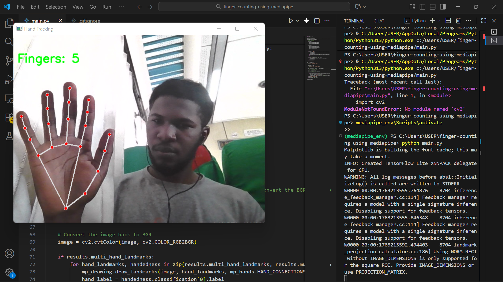

# Finger Counting using MediaPipe

This project uses your webcam to count the number of fingers you are holding up in real-time. It utilizes the MediaPipe library for hand tracking and OpenCV for image processing.

## Author

- **GitHub:** [FiyinfoluwaDav](https://github.com/FiyinfoluwaDav)

## Demo

Here is a demonstration of the application in action:



## Features

- Real-time finger counting using your webcam.
- Tracks a single hand.
- Displays the finger count on the screen.
- Cross-platform (should work on any OS with Python and a webcam).

## Requirements

- Python 3.x
- OpenCV
- MediaPipe

## Installation & Usage

Follow these steps to set up and run the project on your local machine.

### 1. Clone the Repository

First, clone this repository to your local machine:

```bash
git clone https://github.com/FiyinfoluwaDav/finger-counting-using-mediapipe.git
cd finger-counting-using-mediapipe
```

### 2. Create and Activate a Virtual Environment

It is highly recommended to use a virtual environment to keep the project's dependencies isolated.

**On Windows:**

```bash
# Create the virtual environment
python -m venv mediapipe_env

# Activate the virtual environment
.\mediapipe_env\Scripts\activate
```

**On macOS and Linux:**

```bash
# Create the virtual environment
python3 -m venv mediapipe_env

# Activate the virtual environment
source mediapipe_env/bin/activate
```

### 3. Install Dependencies

With your virtual environment activated, install the necessary libraries using pip:

```bash
pip install opencv-python mediapipe
```

### 4. Run the Application

Now you are ready to run the finger counting application:

```bash
python main.py
```

A window will open showing your webcam feed. Hold up your hand to the camera, and the application will draw landmarks and display the number of fingers detected.

To quit the application, press the 'q' key.

## How It Works

The script `main.py` captures video from your webcam. For each frame, it uses the MediaPipe Hands solution to detect and track hand landmarks.

A custom function, `count_fingers`, is used to determine the number of extended fingers based on the position of the finger landmarks. Specifically, it checks:
- If the thumb is extended by comparing the x-coordinates of the thumb tip and the thumb's intermediate joint.
- If the other four fingers are extended by comparing the y-coordinates of their tips and their respective lower joints (dips).

The total count of extended fingers is then displayed on the video feed.
